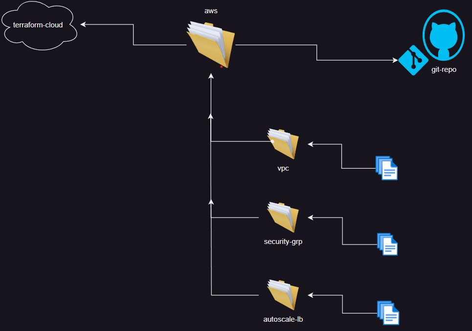

# TERRAFORM-MODULES
Terraform modules are a fundamental aspect of Terraform’s infrastructure-as-code approach, allowing you to organize and reuse configurations efficiently.

**Root Module**: Every Terraform configuration has at least one module, known as the root module, which consists of the resources defined in the main working directory.

In our case : 
- **aws**
       - This Root module has below said child modules for helping in creating multiole resorces of each module 
 
**Child Modules**: A root module can call other modules, known as child modules, to include their resources into the configuration. Child modules can be called multiple times within the same configuration.

In our case :
- **vpc**

  This child module has required resources to create our own Virtual Private Cloud

  It has  variables block to define our own arguments while creating Infrastructure
  
  And it has output block which describes about some resource related attributes
  
  For more documentation, [refer here](https://github.com/Srikanthkovuri/Terraform-modules/blob/main/aws/vpc/README.md) 

- **securitygrp**
  
   This child module has required resources to create our own Security Group for multiple use cases

   It has  variables block to define our own arguments while creating Infrastructure

   And it has output block which describes about some resource related attributes  

   For more documentation, [refer here](https://github.com/Srikanthkovuri/Terraform-modules/blob/main/aws/securitygrp/README.md)

- **autoscalelb**

   This child module has required resources to create our own Auto Scale Group With Load Balancer

   It has  variables block to define our own arguments while creating Infrastructure

   And it has output block which describes about some resource related attributes 
   
   For more documentation, [refer here](https://github.com/Srikanthkovuri/Terraform-modules/blob/main/aws/autoscalelb/README.md) 

  
 